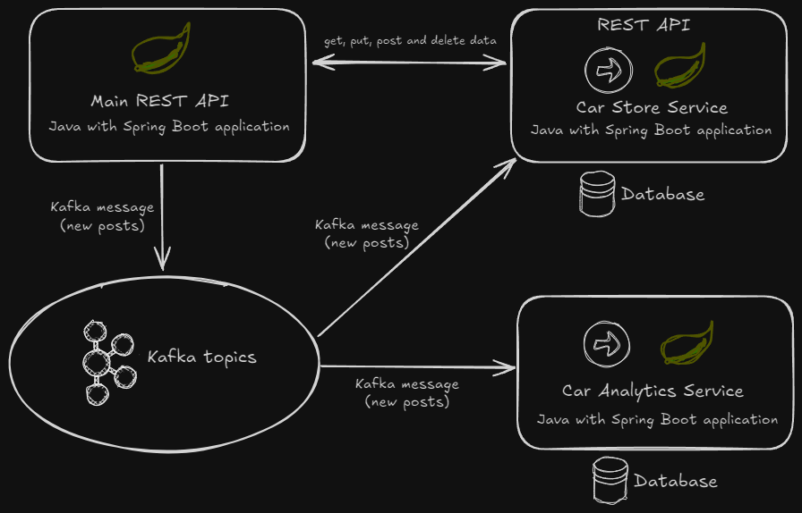

# Car sales system with Spring Boot and Kafka

This project is a study application developed during a course to learn Spring Boot and Kafka. It demonstrates a car sales platform where users can register and sell their cars. The goal was to understand microservices architecture, event-driven communication, and integration with Kafka for scalable message processing.

**Key features:**
- RESTful API built with Spring Boot for posting car advertisements with an owner account.
- Kafka producer and consumer for asynchronous event-driven communication.
- PostgreSQL for storing message metadata.

## Technologies used
This project leverages a modern tech stack to demonstrate proficiency in back-end development and event-driven systems:
- **Java 17**: Core programming language for robust application logic.
- **Spring Boot**: Framework for building RESTful APIs.
- **Apache Kafka**: Distributed streaming platform for high-throughput message brokering.
- **Spring Kafka**: Simplifies Kafka integration with Spring applications.
- **PostgreSQL**: Relational database for persistent storage of message metadata.
- **Maven**: Dependency management and build tool.
- **Docker**: For containerizing PostgreSQL.
- **Lombok**: Reduces boilerplate code for cleaner Java classes.
- **SLF4J with Logback**: For application logging.

## Project architecture


- Main API (```/main-api```): receive requests to get, post, update and delete owner and cars data and send them to a Kafka car post topic through a producer.
- Car post API (```/car-api```): receives cars and owners information from main API through a Kafka consumer and stores it in database.
- Data analytics service (```/data```): receives cars and owners information from main API through a Kafka consumer and stores structured and processed data in database, with the aim of facilitating future data analysis.

## API Endpoints

This section documents the RESTful API endpoints for the **Owner** and **Car** services, which manage owner information and car sale postings in the messaging microservice.

### Owner API
The Owner API handles the creation of owner profiles for car sales.

#### POST `/owner`
- **Description**: Creates a new owner profile.
- **Request Body**:
  ```json
  {
    "name": "Thomas",
    "type": "Particular",
    "contactNumber": "999-888-999"
  }
  ```
- **Response**:
  - **Status**: `200 OK`
  - **Body**: Empty (indicates successful creation).

### Car API
The Car API manages car sale postings, integrating with Kafka for asynchronous processing and a database for persistence.

#### POST `/api/car/post`
- **Description**: Publishes a car sale post to a Kafka topic for asynchronous processing.
- **Request Body**:
  ```json
  {
    "model": "Focus",
    "brand": "Ford",
    "price": "150000",
    "description": "semi-novo",
    "engineVersion": "2.0",
    "city": "São Paulo",
    "createdDate": "",
    "ownerId": 1,
    "ownerName": "Thomas",
    "ownerType": "Particular",
    "contact": "999-888-999"
  }
  ```
- **Response**:
  - **Status**: `200 OK`
  - **Body**: Empty (indicates successful publication to Kafka).

#### GET `/api/car/posts`
- **Description**: Retrieves a list of all car sale posts stored in the database.
- **Response**:
  - **Status**: `302 Found`
  - **Body**: List of car sale posts.
  ```json
  {
    "model": "Focus",
    "brand": "Ford",
    "price": "145000",
    "description": "semi-novo, revisado",
    "engineVersion": "2.0",
    "city": "São Paulo",
    "createdDate": "2025-08-25T10:14:00Z",
    "ownerId": 1,
    "ownerName": "Thomas",
    "ownerType": "Particular",
    "contact": "999-888-999"
  }
  ```

#### PUT `/api/car/{id}`
- **Description**: Updates an existing car sale post identified by `id`.
- **Path Parameter**:
  - `id`: The unique identifier of the car post (e.g., a UUID or database ID).
- **Request Body**:
  ```json
  {
    "model": "Focus",
    "brand": "Ford",
    "price": "145000",
    "description": "semi-novo, revisado",
    "engineVersion": "2.0",
    "city": "São Paulo",
    "createdDate": "2025-08-25T10:14:00Z",
    "ownerId": 1,
    "ownerName": "Thomas",
    "ownerType": "Particular",
    "contact": "999-888-999"
  }
  ```
- **Response**:
  - **Status**: `200 OK`
  - **Body**: Empty (indicates successful update).

#### DELETE `/api/car/{id}`
- **Description**: Deletes a car sale post identified by `id`.
- **Path Parameter**:
  - `id`: The unique identifier of the car post.
- **Response**:
  - **Status**: `200 OK`
  - **Body**: Empty (indicates successful deletion).
 
## Lessons Learned
Through this project, I developed skills in:
- Designing and implementing RESTful APIs with Spring Boot.
- Configuring Kafka producers and consumers for event-driven systems.
- Integrating Spring Boot with PostgreSQL using Spring Data JPA.
- Handling message serialization/deserialization with JSON.
- Understanding Kafka’s role in scalable, asynchronous communication.
